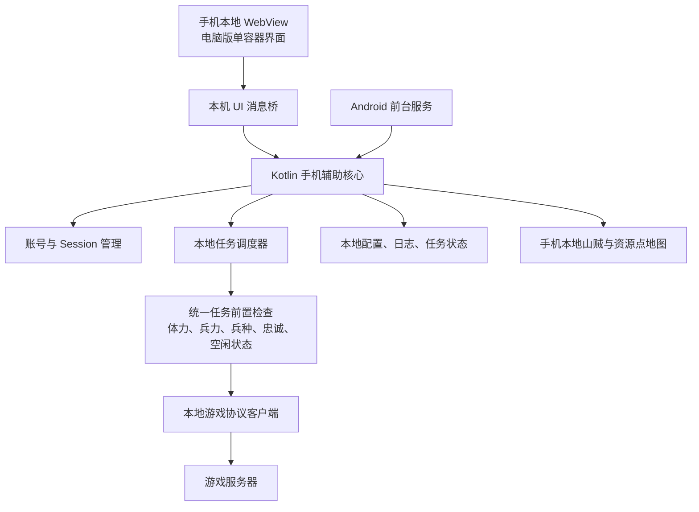

# 手机端辅助 V1 架构

> 文档版本：V1  
> 更新日期：2026-07-28  
> 核心结论：手机端是完整、独立的辅助执行核心。除未来版本可选的山贼地图同步外，手机端运行不依赖电脑端辅助；V1 不实现任何手机与电脑之间的地图通信。

## 1. 目标

手机端辅助必须在电脑关机、电脑端辅助未启动、电脑与手机不在同一网络等情况下，仍能独立完成以下工作：

- 登录游戏并维护账号 Session。
- 读取并保存角色、资源、将领、军队、背包等状态。
- 独立运行副本、刷黄、无损、掠夺、打矿、日常、内政等任务。
- 在所有出征类任务执行前统一检查体力、兵力、兵种、忠诚和将领状态。
- 将领体力低于用户设置值时自动加体，然后复查并继续任务。
- 使用手机自身网络直接请求游戏服务器。
- 手机锁屏或退出界面后，继续在后台运行用户已经启动的任务。
- 自行扫描、缓存和使用山贼及资源点数据，不依赖电脑端地图。
- 保持与电脑版辅助单个容器基本一致的 UI、控件和操作逻辑。

## 2. V1 范围

### 2.1 V1 必须实现

- 手机本地账号管理、真实登录和 Session 管理。
- 手机本地任务配置、任务调度、运行状态、日志和每日完成记录。
- 手机直接发送全部游戏协议请求。
- 安全保存后台自动重连所需的凭据。
- 锁屏后台运行、网络恢复和 Session 失效重登。
- 手机本地山贼扫描、目标缓存、目标选择、失效清理和出征。
- 手机本地资源点扫描、目标选择和出征。
- 本地打包并显示电脑版辅助的单个容器界面。
- 删除手机端的 IP、代理、节点和电脑端连接设置。

### 2.2 V1 明确不实现

- 手机向电脑端上传山贼地图。
- 手机从电脑端下载山贼地图。
- 手机与电脑端辅助之间的账号、任务、日志或配置同步。
- 电脑端代替手机执行游戏请求。
- 手机端总控、多容器、山贼地图工具页、资源地图工具页。
- “一键开始全部任务”等电脑端批量控制入口。
- App 内的代理、VPN、IP 检测、IP 切换和节点管理。

未来版本可以增加山贼地图同步，但同步只能是可选的异步增强能力，不能成为手机本地扫描、选目标或出征的前置条件。

## 3. 总体架构



V1 的正式请求链路只有：

```text
手机本地界面
  → 手机 Kotlin 辅助核心
  → 手机本地任务调度与协议客户端
  → 游戏服务器
```

不存在以下链路：

```text
手机 → 电脑端辅助 → 游戏服务器
```

## 4. 技术栈

V1 继续采用当前项目已经使用的原生 Android 技术路线：

- 开发语言：Kotlin。
- Java 运行环境：Java 17。
- Android SDK：minSdk 23，targetSdk/compileSdk 36。
- UI 宿主：原生 Android Activity + 本地 WebView。
- 容器界面：HTML、CSS、JavaScript，构建 APK 时打包到本地 assets。尽可能不改动目前的UI界面。
- 协议执行：Kotlin 本地游戏协议客户端。
- 网络连接：手机进程直接建立 HTTP/HTTPS 连接。
- 后台运行：Android Foreground Service。
- 本地持久化：Repository 抽象下的本地账号、配置、日志、状态和地图存储。
- 敏感数据保护：Android Keystore 加密。
- 测试：JVM 单元测试、Android 仪器测试和真机锁屏回归。

V1 不引入 Flutter、React Native、Jetpack Compose，也不在 Android 内嵌 Python 电脑端后端。

## 5. 界面架构

### 5.1 本地打包单个容器

电脑版辅助前端的 `index.html`、`app.js` 和 `styles.css` 作为共同界面源，在构建 APK 时复制或同步到 Android assets。手机 WebView 只能加载 APK 内的页面，不再加载电脑端 URL。

手机模式只呈现一个辅助容器，并隐藏以下电脑专属内容：

- 总控。
- 新增、删除和管理多个容器的工具栏。
- 山贼地图和资源地图工具页入口。
- 一键开始全部任务。
- IP、代理、节点和线路信息。

攻略中的查名将、查开服时间和查攻略继续使用 APK 内的静态资料或手机本地查询逻辑。

### 5.2 本机 UI 消息桥

前端界面不得再通过 Mobile API 请求电脑端。页面中的账号、设置、任务和日志操作统一经过本机异步消息桥调用 Kotlin 核心。

建议在前端抽象统一的 `AssistantApi`：

- 电脑版适配器可以继续使用 HTTP API。
- Android V1 适配器使用本机 WebView 消息桥。
- 两端共享相同的请求和响应数据模型。
- Android 消息桥仅允许 APK 内固定来源调用，不接受任意网页导航。

这样可以共享一个容器的 UI 和控件语义，同时保证手机运行时完全不依赖电脑端服务。

## 6. 手机本地执行核心

手机本地执行核心是唯一事实源，负责：

- 账号与区服管理。
- 登录、Session 刷新和自动重登。
- 角色状态同步。
- 任务配置读取与保存。
- 任务计划生成与调度。
- 每日成功次数和完成锁。
- 将领、编队和任务互斥。
- 所有真实游戏动作。
- 任务日志、错误通知和运行状态。
- 本地山贼及资源点地图。

Activity 和 WebView 只负责展示与操作，不能拥有独立任务循环。即使 Activity 被销毁，只要用户没有停止托管，执行核心仍由前台服务继续运行。

## 7. 账号、凭据与 Session

### 7.1 安全存储

完全独立托管要求手机能够在 Session 失效后自动重新登录，因此不能继续采用“密码只用于本次登录且完全不保存”的模式。

V1 应采用以下规则：

- 用户启动无人值守托管前，明确确认允许本机安全保存登录凭据。
- 密码、Session Token 和其他敏感认证字段使用 Android Keystore 加密。
- 不以明文写入 SharedPreferences、JSON、日志或导出文件。
- `android:allowBackup` 保持关闭，敏感字段不进入系统备份。
- 删除账号时同步删除对应凭据和 Session。
- 日志只记录账号标识、动作和结果，不输出密码、Token、`gameHttp`、`dm` 等敏感值。

### 7.2 自动重连

每个启用的账号拥有独立 Session 状态机：

```text
未登录
  → 登录中
  → 在线
  → Session 失效或网络断开
  → 退避等待
  → 自动重新登录
  → 刷新真实状态
  → 恢复任务
```

网络恢复或重新登录后，必须先从游戏服务器重新同步真实状态，再决定是否继续未完成任务，不能直接重放上一次可能已经成功的动作。

## 8. 网络与 IP

### 8.1 请求来源

所有游戏协议请求由手机 App 进程直接发出，不经过电脑端、App 内代理或本地 VPN。

- 手机使用 Wi-Fi 时，游戏服务器看到的是当前 Wi-Fi 网络的公网出口 IP。
- 手机使用移动数据时，游戏服务器看到的是运营商出口 IP。
- 用户主动开启 Android 系统 VPN 时，系统可能使用 VPN 出口 IP，这属于手机系统网络行为。

手机端不提供以下功能：

- 当前 IP 显示。
- IP 检测。
- IP 切换。
- 代理节点列表。
- 账号代理绑定。
- 防封 IP 开关。
- 本地 VPN 服务。

请求间隔、失败退避和同服互斥仍然保留，但应作为任务安全和服务器压力控制，不再以“切换 IP”命名或实现。

### 8.2 网络切换

手机需要监听网络状态变化：

- Wi-Fi 与移动数据切换后重新验证 Session。
- 网络中断时暂停真实动作，不把网络失败记录为任务成功。
- 使用指数退避重试，避免断网期间高频请求。
- 网络恢复后先同步角色、将领、军队和任务状态，再恢复调度。

## 9. 任务调度架构

### 9.1 单一调度所有者

前台服务是任务调度的唯一所有者。UI 只能发送启动、停止、保存配置和立即刷新等命令，不能直接启动另一套调度循环。

每个账号使用串行任务队列或账号级 Actor，确保同一账号不会同时发送互相冲突的动作。多个账号可以共存，但都使用手机当前同一网络出口。

任务优先级和互斥至少覆盖：

- 无损、刷黄、副本之间的将领占用冲突。
- 打矿、掠夺与其他出征任务之间的将领占用冲突。
- 同一账号的状态刷新与真实动作串行化。
- 同一将领不能同时加入两次出征。

### 9.2 持久化运行状态

需要持久化：

- 已启用任务。
- 当前运行任务。
- 下一次运行时间。
- 当日成功次数和完成标记。
- 将领和编队占用状态。
- 最近一次真实动作及其可核验结果。
- 停止原因和错误状态。

App 进程重建后，必须先与服务器核对真实状态，再恢复任务，不得仅依赖进程内变量。

## 10. 统一出征前置检查

副本、刷黄、无损、掠夺、打矿和未来新增的所有出征任务，必须调用同一个 `ExpeditionPreflight` 或等价的统一前置检查器。

标准流程为：

```text
准备执行任务
  → 验证账号在线和 Session 有效
  → 刷新角色、将领和军队状态
  → 检查将领是否空闲
  → 检查体力是否低于用户设置值
  → 低于设置值则自动使用体力道具
  → 再次刷新并确认体力
  → 检查忠诚、兵种、兵量和编队
  → 可以自动修正的先修正
  → 再次复查
  → 搜索或验证目标
  → 发送真实出征请求
  → 解析结果并持久化状态
```

自动加体属于账号级通用出征能力，不属于刷黄任务的私有逻辑。只要用户开启自动加体，任何任务在检查时发现将领体力低于阈值，都应先自动加体。

任何前置检查或自动修正失败时必须明确暂停当前任务并记录原因，不能继续盲目发送出征请求，也不能把 dry-run 或 mock 结果显示成成功。

## 11. 本地山贼与资源点地图

### 11.1 V1 本地山贼流程

```text
任务需要山贼目标
  → 查询手机本地新鲜目标
  → 没有可用目标时调用游戏协议扫描
  → 保存扫描结果
  → 按任务条件筛选目标
  → 出征前重新验证目标
  → 出征成功后更新目标状态
  → 目标失效时删除并继续扫描
```

本地地图记录至少包含：

- 区服标识。
- 目标 ID。
- X/Y 坐标。
- 目标类型。
- 等级和可解析的筛选字段。
- 首次发现时间。
- 最近验证时间。
- 失效时间或失效原因。

空闲扫描只能在没有更高优先级任务时低频执行，并受到统一请求间隔限制。

### 11.2 V1 本地资源点流程

资源点搜索和打矿同样使用本机协议结果。协作服务不存在或电脑无法访问时，不得以此作为禁止本地出征的原因。

### 11.3 未来地图同步边界

可以预留 `MapSyncPort` 一类接口，但 V1 不构造 HTTP 实现、不显示电脑地址、不上传、不下载，也不发起健康检查。

未来同步模块必须遵守：

- 同步失败不阻断本地任务。
- 电脑数据只能作为候选目标补充。
- 出征前仍由手机向游戏服务器验证目标。
- 本地扫描结果即使未上传，也可以直接用于出征。

## 12. 锁屏与后台运行

### 12.1 前台服务

目标 SDK 36 下，不应继续使用可能受到持续时长限制的 `dataSync` 类型承载无限期托管。V1 应使用符合实际用途的 `specialUse` 前台服务：

- 用户主动启动托管后创建持续通知。
- 通知明确显示运行账号、当前任务和停止入口。
- 正常申请通知权限。
- 引导用户正常授予忽略电池优化权限。
- 在任务运行期间保持必要的 CPU WakeLock。
- 需要稳定 Wi-Fi 时使用适当的 Wi-Fi Lock。
- Activity 退出和屏幕锁定不停止服务。
- 用户从通知或 App 点击停止后释放全部锁和资源。

如果通过 Google Play 分发，需同步满足 `specialUse` 前台服务的政策声明和审核要求。

### 12.2 系统边界

- 用户在系统设置中“强制停止”App 后，Android 不允许 App 自行绕过该状态恢复。
- 部分国产系统需要用户额外允许自启动和后台运行，App 应提供引导但不能使用非正常绕过方式。
- 手机重启后，只恢复用户此前明确启用的托管。
- 为确保加密凭据可用，重启后建议在用户首次解锁设备后恢复真实登录和任务。

## 13. 本地存储

V1 的 Repository 层至少分为：

- `AccountRepository`：账号基本信息和启用状态。
- `CredentialVault`：Keystore 加密凭据。
- `SessionRepository`：加密 Session 与登录状态。
- `ConfigRepository`：每个账号的任务配置。
- `RuntimeStateRepository`：运行状态、完成锁和下一次执行时间。
- `TaskLogRepository`：账号任务日志和系统日志。
- `LocalMapRepository`：山贼和资源点缓存。
- `RequestHealthRepository`：最近请求结果。

V1 可以先沿用已有本地 Repository 和 JSON 配置格式，但敏感信息必须先完成加密；当并发写入、查询和迁移需求增大时，再将结构化数据迁移到 Room。UI 和任务核心只依赖 Repository 接口，不直接依赖具体存储方式。

## 14. 正式代码与测试代码隔离

当前工程仍存在 `MockGameProtocolClient`、mock Session、dry-run 和若干 `REAL_*_NOT_IMPLEMENTED` 路径。V1 正式运行必须满足：

- 没有真实 Session 时不创建 mock 任务。
- 生产构建不把 mock 结果作为任务成功结果。
- 未实现的真实动作明确标记为不可用。
- 每个已开放功能都必须存在真实协议发送、响应解析和真机回归证据。
- Mock 客户端只用于单元测试或显式调试构建。

## 15. 需要退出 V1 正式运行路径的模块

以下模块应删除，或至少从正式构建、入口和运行路径中完全移除：

- `RemoteCoreActivity`。
- `DesktopCoreApiClient`。
- `DesktopCoreSettingsRepository`。
- `RemoteCoreBackgroundPolicy`。
- `RemoteCoreKeepAliveService`。
- 电脑端地址和 Mobile API Token 设置。
- 手机启动时自动打开电脑端核心的逻辑。
- `LocalProxyVpnService`。
- `GameNetworkRoute` 中的账号级 HTTP/SOCKS 代理选择。
- IP、节点和防封 IP 配置字段。
- 依赖电脑端或云端地图才允许出征的逻辑。
- 开机后只恢复远程核心保活的逻辑。

`BootCompletedReceiver` 应改为：仅在用户此前开启本地托管时，恢复手机本地前台服务；不能再恢复电脑端连接保活。

## 16. 建议迁移顺序

### 阶段一：反转执行权

1. 停止启动 `RemoteCoreActivity`。
2. 删除电脑端统一核心设置入口。
3. 将 `AssistantForegroundService` 设为唯一正式任务宿主。
4. 正式调度只加载启用且拥有真实 Session 的本地账号。
5. 禁止生产路径回退到 mock Session 或 mock 任务。

### 阶段二：本地容器界面

1. 将共同前端打包到 APK。
2. WebView 改为加载本地 assets。
3. 建立本机 `AssistantApi` 消息桥。
4. 依次接入账号、快照、配置、任务、日志和攻略接口。
5. 保持手机模式只显示一个容器并隐藏电脑专属控件。

### 阶段三：独立登录与后台恢复

1. 增加 Keystore 凭据仓库。
2. 完成 Session 失效自动重登。
3. 完成网络切换后的状态恢复。
4. 将前台服务改为适合长期运行的类型。
5. 修改开机恢复逻辑。

### 阶段四：任务闭环

1. 建立统一出征前置检查器。
2. 将自动加体接入所有出征任务。
3. 按副本、刷黄、无损、掠夺、打矿等功能逐项清除 mock/dry-run。
4. 对每个真实动作补充响应解析、失败恢复和持久化状态。
5. 完成多账号串行与将领占用互斥。

### 阶段五：本地地图

1. 山贼扫描和缓存完全本地化。
2. 山贼目标失效后自动重扫。
3. 资源点搜索和选矿完全本地化。
4. 删除协作地图不可用时禁止出征的规则。
5. 确认 V1 不会请求任何电脑端地图接口。

### 阶段六：回归与清理

1. 删除远程核心和代理相关遗留代码。
2. 更新 README、产品说明和覆盖检查脚本。
3. 完成单元测试、APK 构建和真机验证。
4. 长时间锁屏运行并验证网络切换、Session 过期和进程重建。

## 17. V1 验收标准

V1 只有同时满足以下条件才算完成：

1. 电脑关机且电脑端辅助未运行时，手机可以添加账号、登录、保存设置、启动和停止任务。
2. 手机可以独立执行已开放的副本、刷黄、无损、掠夺、打矿和其他任务。
3. 游戏服务器连接由手机当前网络出口发起，不经过电脑端或 App 内代理。
4. 手机界面不包含电脑地址、Mobile API Token、IP、代理或节点设置。
5. 手机本地没有新鲜山贼数据时，可以自行扫描并继续出征。
6. 手机本地没有资源点数据时，可以自行搜索并继续打矿。
7. 电脑端地图不存在或不可访问，不会阻断任何手机任务。
8. 副本、刷黄、无损、掠夺和打矿全部经过统一自动加体检查。
9. 手机锁屏连续运行超过 6 小时后，前台服务、任务调度和网络请求仍正常。
10. Wi-Fi 与移动数据切换、短时断网和 Session 失效后能够自动恢复。
11. Activity 或 WebView 被关闭后，用户已经启动的托管仍由前台服务继续运行。
12. 手机重启并首次解锁后，可以按照用户之前的设置恢复本地托管。
13. 抓取手机流量时，不出现电脑端 Mobile API、电脑地图上传下载或电脑端健康检查请求。
14. 生产运行不会把 mock、dry-run 或未实现动作显示为真实成功。
15. 手机端 UI、操作逻辑和控件含义与电脑版辅助的单个容器保持一致。

## 18. V1 最终定义

手机端辅助 V1 是一个安装并运行在 Android 手机上的完整辅助程序：

- 界面在手机本地运行。
- 账号和配置保存在手机本地。
- 调度器在手机本地运行。
- 游戏协议在手机本地生成和解析。
- 游戏请求由手机自身网络发出。
- 任务和地图均可在手机本地独立工作。
- 电脑端不存在时，手机端功能不受影响。

电脑端与手机端的山贼地图互通属于后续版本能力，不属于 V1，也不能改变手机端“始终可以独立运行”的基本原则。

## 19. 当前实现进度

截至 2026-07-28，除真机回归外，电脑端单账号容器与手机本地容器的开放功能已完成代码与离线行为对齐：

- 账号真实登录、启停、删除、自动重登、状态刷新和后台恢复。
- 配兵、刷黄、打矿、无损、副本、掠夺、内政、背包、金银花种植、七项日常、军情和警报。
- 页面与后台共用账号锁；关闭或掉线账号不能继续使用保留 Session 发包。
- 日志为有界 JSONL，使用单调游标；成功记录只接受结构化成功事实。
- 竞技币按中国时区 22:00 切日，其余日常 00:00 切日；国民跳过不适用日常。
- 登录缓存真实封地坐标并据此计算刷黄推荐中心，缺失时失败关闭。
- 抢城、押镖、寻宝、连体物品整理在界面置灰，旧调用在 API 层同样拒绝。

尚未完成且本轮不执行的是第 17 节中依赖 Android 真机的安装、逐功能真实动作、长时间锁屏、网络切换、进程重建、重启恢复和抓包验收。这里的“代码已对齐”不等同于“真机验收已通过”。
