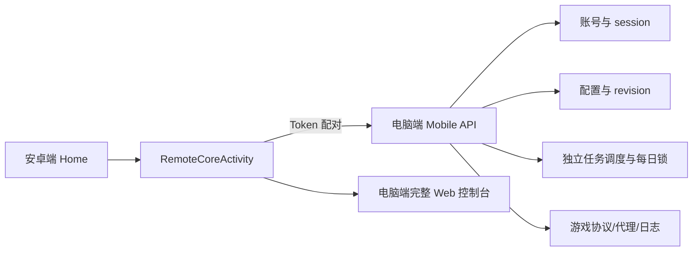

# 电脑端与安卓端统一核心功能矩阵

更新时间：2026-07-25

## 结论

安卓端不再维护第二套游戏协议。电脑端是唯一执行核心，安卓端是远程控制和展示端；这样可以消除“电脑端新增一个接口、安卓端再逆向/再实现一次”的结构性重复。



## 第一性原理决策

| 问题 | 决策 | 原因 |
|---|---|---|
| 谁持有游戏 session/token？ | 电脑端 | 降低泄露面，避免两端 session 竞争和状态漂移 |
| 谁执行真实游戏请求？ | 电脑端 | 协议、限速、重连、代理、回执解析只有一份 |
| 手机如何拥有全部页面？ | 同源 WebView 复用电脑端页面 | 功能天然与电脑端一致，UI/接口修复不分叉 |
| 手机如何做原生控制？ | `DesktopCoreApiClient` 薄客户端 | 只封装健康检查、快照、设置、任务和日常动作 |
| 多个日常功能如何互不影响？ | 每个功能独立配置、锁、完成标记和日志 | 一个失败不会阻断兄弟功能 |
| 配置被电脑端同时修改怎么办？ | revision 乐观锁，冲突返回 409 | 避免手机覆盖电脑端最新设置 |
| 写请求重复发送怎么办？ | `Idempotency-Key` + 设备 ID | 网络重试不会重复执行动作 |

## 功能对照

“可用”表示安卓能看到与电脑端相同的入口并通过电脑端执行；协议尚未被电脑端确认的项目，仍会按照电脑端的失败关闭/只保存策略，不会在手机端伪造成功。

| 电脑端区域/功能 | 安卓入口 | 执行归属 | 状态 |
|---|---|---|---|
| 账号列表、添加、启动、停止、删除、重连 | 电脑端统一核心 → 账号 | 电脑端 | 已接入 Mobile API/共享控制台 |
| 角色、资源、将领、军队、背包、科技、军情 | 角色侧栏/账号快照 | 电脑端读取并脱敏返回 | 已接入 |
| 常规-常用（内政、加体、粮转铜、物品等） | 完整控制台 | 电脑端旧 API 白名单桥 | 已接入 |
| 自动签到 | 常规-日常 | 独立 `signIn` | 已接入 |
| 领竞技币 | 常规-日常 | 独立 `arenaCoins` | 已接入 |
| 自动捐献：铜钱 + 粮食 + 科技积分 | 常规-日常 | 独立 `donate`，一次依次尝试 3 个接口 | 已接入 |
| 国家俸禄 | 常规-日常 | 独立 `salary` | 已接入电脑端链路 |
| 国家征收 | 常规-日常 | 独立 `nationalCollect`，按高价值候选尽量收取 | 已接入电脑端链路 |
| 城主征收 | 常规-日常 | 独立 `cityLordCollect`，逐城调用 | 已接入电脑端链路 |
| 名将拜访 | 俸禄下方/常规-日常 | 先查候选，再按顺序最多 4 名顺延尝试 | 已接入电脑端链路 |
| 刷黄 | 刷黄页面 | 电脑端调度、地图和真实协议 | 共享完整页面；能力以电脑端当前实现为准 |
| 打矿 | 打矿页面 | 电脑端调度、地图和真实协议 | 共享完整页面；能力以电脑端当前实现为准 |
| 军事：掠夺/抢城/无损/副本/押镖/寻宝 | 军事页面 | 电脑端协议与任务 | 共享完整页面；未确认协议按电脑端失败关闭 |
| 六部 | 六部页面 | 电脑端协议与任务 | 共享完整页面 |
| 警报/日志/提示 | 角色与日志页面 | 电脑端事件、日志和通知 | 已接入 |
| 查名将、查攻略、查开服时间 | 安卓原生“其他” | 安卓本地资料 | 保留，不受远程核心影响 |
| `+容器` 多窗口布局 | 无 | 不迁移 | 这是电脑版展示布局，不是游戏执行能力；手机通过账号选择与总控管理全部账号 |
| 山贼地图、资源地图 | 电脑端核心工具栏 | 电脑端共享地图查询/筛选/缩放 | 已接入，手机模式不再隐藏 |

## 日常任务的独立生命周期

```text
签到 ───────────────┐
竞技币 ─────────────┤ 各自 validate → 独立锁 → 执行 → 完成标记 → 日志
三项捐献（3接口） ──┤
国家俸禄 ───────────┤ 任何一项失败只影响自己
国家征收 ───────────┤
城主征收 ───────────┤
名将拜访（最多4名） ─┘
```

名将拜访的顺序规则：手机先调用候选查询，显示姓名、武力、智力、统帅；用户勾选顺序被保留，重复 ID 去重，最多 4 个。电脑端按该顺序逐个尝试，某名将因状态、次数或服务器原因不能拜访时，记录原因并继续下一个。

## Mobile API 安全与运维

- 默认仅监听 `127.0.0.1`；局域网绑定必须同时提供 `DWPM_MOBILE_API_TOKEN`。
- 手机使用 `Authorization: Bearer`、`X-Device-Id`；写操作带 `Idempotency-Key`。
- API 返回 `accountRef` 而非原始 session ID；响应会移除密码、游戏 token、`gameHttp`、`dm`、代理密码等字段。
- 局域网静态文件仅开放手机控制台所需的 `index.html`、`app.js`、`styles.css`；数据库、日志、报告和源码不可下载。
- WebView 只允许同源导航，关闭文件访问；配对 query token 交换为 `HttpOnly` Cookie。
- `DWPM_MOBILE_API_SECRET` 建议固定为随机值，保证账号引用跨重启稳定；启动器会把 Token/Secret 写入用户目录下的私有配置文件（不在网页根目录，权限 600）。
- 电脑端原有 `/api/*` 路由仍由同一进程处理，手机 WebView 不会绕过电脑端的账号锁、每日锁或回执校验。

## 验收顺序

1. 手机测试连接和能力列表。
2. 读取测试账号列表、快照、设置 revision、任务状态和日志；确认没有敏感字段。
3. 查询名将候选，验证姓名/武力/智力/统帅和顺序限制。
4. 只启动一个测试账号的一项日常功能，观察电脑端日志和完成状态。
5. 再验证一个失败场景（例如候选不可拜访或单项捐献被拒），确认兄弟功能仍可执行。
6. 最后才考虑多账号并行，不直接批量执行真实动作。

## 回归证据

- 电脑端：`python3 -m unittest discover -s tests -p 'test*.py'` → 380 项通过。
- 电脑端前端：`node --check app.js` → 通过。
- 安卓端：`./gradlew :app:testDebugUnitTest :app:assembleDebug` → 368 项通过，Debug APK 已生成。
